# 国家労働局 組織図 設定資料

国家労働局は、通常省庁ではなく内閣の下に置かれる特別行政機関である。

組織上は行政官庁であり、軍隊や警察の階級制度は持たない。職員の序列は、階級ではなく官職、職位、職務上の指揮権によって定まる。

ただし、強制介入班は緊急保護介入、危険施設封鎖、証拠初期保全を実地で行う武装実働部隊であるため、現場では班長、副班長、分隊長、組長、隊員といった準軍事的な職務呼称を用いる。

---

## 組織図

```mermaid
flowchart TB
  A["国家労働局総裁"]

  A --> B["総裁官房"]
  B --> B1["総裁補佐官"]
  B --> B2["対外調整室"]
  B --> B3["政策企画室"]
  B --> B4["報道官室"]

  A --> C["総務部"]
  C --> C1["人事課"]
  C --> C2["経理課"]
  C --> C3["施設管理課"]
  C --> C4["文書管理課"]
  C --> C5["情報公開・苦情対応室"]

  A --> D["法務部"]
  D --> D1["法務審査課"]
  D --> D2["証拠移管調整課"]
  D --> D3["権限審査室"]

  A --> E["監督部"]
  E --> E1["監査執行課"]
  E1 --> E1a["強制介入班"]
  E --> E2["施設監査課"]
  E --> E3["労務監督課"]
  E --> E4["福祉委託監査課"]
  E --> E5["重要施設警備監督連絡室"]

  A --> F["情報部"]
  F --> F1["特別調査解析室"]
  F --> F2["情報保全課"]
  F --> F3["データ照会統制課"]
  F --> F4["外部情報連絡室"]

  A --> G["支援部"]
  G --> G1["電子戦支援課"]
  G --> G2["装備管理課"]
  G --> G3["航空運用課"]
  G --> G4["機械運用課"]
  G --> G5["医療・搬送支援課"]
  G --> G6["通信基盤課"]

  A --> H["監察部"]
  H --> H1["内部監察課"]
  H --> H2["職務倫理審査課"]
  H --> H3["権限濫用調査室"]
```

---

## 部局別の役割

### 総裁官房

総裁の意思決定、対外調整、政策企画、報道対応を支える中枢部局。

労働局は政治的に燃えやすい組織であるため、報道官室は単なる広報ではなく、強制介入後の説明責任、企業群からの批判対応、議会向け説明、被害者保護に関する情報統制も扱う。

### 総務部

人事、経理、施設、文書、情報公開、苦情対応を担う一般管理部局。

強い権限を持つ労働局が行政機関として成立するための基盤であり、予算執行や人事管理、公開請求への対応を通じて、外部監査と議会統制の対象にもなる。

### 法務部

労働局の権限行使が法的に成立するかを審査し、保全した証拠や拘束した身柄を国家警察、検察、裁判所手続へ接続する部局。

強制介入は労働局だけで完結しない。法務部は、緊急保護介入の根拠、事後審査、証拠移管、令状取得、他機関連携の法的な筋道を整える。

### 監督部

労働局の本筋である監査、臨検、労務監督、福祉委託監査、重要施設警備監督との接続を担う部局。

監査執行課の下に強制介入班が置かれる。これは、介入班の目的が戦闘ではなく、監督権限の実地執行、要保護者の保全、危険の除去、証拠初期保全であるためである。

### 情報部

複合犯罪の線をつなぐための調査解析、情報保全、外部情報の整理、道路網監視システム等への照会統制を担う部局。

情報部は情報機関ではない。だが、企業群の犯罪が福祉、港湾、警備、保守、法務、物流に分解されている以上、複数制度の記録を横断的に解析する能力が必要になる。

### 支援部

電子戦支援、装備管理、航空運用、機械運用、医療・搬送支援、通信基盤を担う作戦支援部局。

支援部は、介入班と情報部の双方を支える。ドアノッカー、フォーアイズ、非殺傷制圧機、通信中継、ECM、UAV管制、作戦用S/VTOL機の運用は、支援部の管理下に置かれる。

電子戦支援課は支援部所属である。ただし、CICでの実運用では情報部 特別調査解析室と一体に動くため、作中では情報部側の席にいる、又は情報部支援として呼ばれる場合がある。

### 監察部

内部監察、職務倫理審査、権限濫用調査を担う部局。

労働局は越権に近い領域で動くことを制度上許されているため、内部監察は飾りではない。強制介入、限定的強制調査、情報照会、証拠保全が適法な範囲を超えていないかを後から検証する。

---

## 主な職位と呼称

労働局では、軍階級ではなく行政上の職位を用いる。

- 総裁
- 局次長
- 官房長
- 部長
- 課長
- 室長
- 班長
- 副班長
- 主任調査官
- 主任技官
- 上席調査官
- 上席分析官
- 調査官
- 監督官
- 技官
- 事務官

強制介入班では、現場指揮のために次の呼称を併用する。

- 班長
- 副班長
- 分隊長
- 組長
- 隊員

無線上では、任務ごとにコールサインを用いる。これは階級ではなく、作戦中の識別と指揮系統を明確にするためのもの。

---

## 主要人物の所属整理

| 人物 | 所属・職位 |
|---|---|
| アルテミシア | 国家労働局総裁 |
| 橘伊吹 | 監督部 監査執行課 強制介入班班長 兼 総裁官房 総裁補佐官 |
| 金剛寺 | 監督部 監査執行課 強制介入班副班長 |
| ナディア・グロモワ | 情報部 特別調査解析室 上席分析官 |
| 項宗梧 | 支援部 電子戦支援課 主任技官 |
| 法務部長 | 法務部長 |

---

## 作中運用メモ

本文では、組織図をすべて説明しない。

必要な場面で、総裁、法務部長、監査執行課長、橘班長、金剛寺副班長、グロモワ上席、項主任技官のように呼称だけを出す。

読者に必要なのは詳細な官庁説明ではなく、誰が判断し、誰が現場に出て、誰が法的な受け皿を作り、誰が支援を回すかである。
