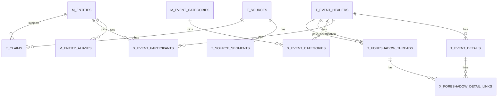

# 検索DBモデリング方針（AppSheet非依存）

本資料は、`$appsheet-db-design` の設計原則をベースに、執筆支援向け検索DB（SQLite想定）の標準設計を定義する。

## 0. 今回の実施計画（結合/新規）

既存テーブルへ結合して対応:

- `relations` -> `x_entity_relationships`
- `t_claims(canon)` -> `t_canon_assertions`
- `t_canon_assertions` × `t_claims(draft/post)` -> `t_canon_conflicts`
- `m_entities` + 人物系 `t_claims` -> `x_entity_axes`（`m_character_axes` を参照）
- `t_event_headers` + 文脈キーワード -> `x_event_locations`（`m_locations` を参照）

新規テーブル作成が必要:

- `m_factions`, `m_regional_commands`, `x_faction_members`
- `m_units`, `x_entity_unit_history`
- `m_locations`
- `m_terms`, `m_magic_rules`, `m_enemy_taxonomy`
- `m_character_axes`, `x_entity_axes`
- `t_canon_assertions`, `t_canon_conflicts`
- `t_consistency_runs`, `t_consistency_findings`
- `t_story_kv`（JSONキーバリュー簡易層）

## 1. 基本ルール

1. SSOTは `canon`。`drafts/posts` は主張（claim）として別管理する。  
2. マスタとトランザクションを分離する。  
3. 多対多は必ず中間テーブルで表現する。  
4. 進捗・状態は Enum 相当のステータス列で管理する。  
5. 出典（ファイル・行番号）を全トランザクションに残し、監査可能にする。  
6. 非正規化は「表示高速化の派生列」に限定し、再生成可能にする。  
7. 時間は `date_start/date_end/date_precision` の3点セットで統一する。  
8. 検索は `FTS`（全文）と構造化検索（FK/INDEX）を併用する。  
9. 仕様が流動的な領域は `t_story_kv` に先行投入し、固まったら正規化テーブルへ昇格する。  

## 2. テーブル群

### 2.1 マスタ

- `m_entities`  
  - 人物/組織/地名などのエンティティ
- `m_entity_aliases`  
  - 表記ゆれ（榊 / 榊恒一 など）
- `m_event_categories`  
  - イベントカテゴリ（戦闘、回収、政治、伏線など）
- `m_ranks`  
  - 階級マスタ（`rank_order` 付き）
- `m_branches`  
  - 兵科マスタ
- `m_arsenals`  
  - 武器マスタ
- `m_vehicles`  
  - 車両マスタ
- `m_ammo_types`  
  - 弾薬種マスタ（武器種/口径/弾種）
- `m_spells`  
  - 術式マスタ（カテゴリ/対象範囲/属性/詠唱）
- `m_factions`  
  - 勢力マスタ（正式名称/略称/和名/和略称/兵力/HQ/友好度/技術力）
- `m_regional_commands`  
  - 地方司令部マスタ（勢力FK/Location FK）
- `m_status_codes`  
  - ステータス辞書（任意。アプリ側固定なら省略可）

### 2.2 トランザクション

- `t_event_headers`  
  - イベント見出し（時期・進捗・正史区分）
- `t_event_details`  
  - 見出し配下の詳細行（seqで順序管理）
- `x_event_participants`  
  - イベント参加者（event × entity）
- `x_event_categories`  
  - イベントカテゴリ（event × category）
- `t_foreshadow_threads`  
  - 伏線スレッド本体
- `x_foreshadow_detail_links`  
  - 伏線と詳細の紐付け（plant/reinforce/misdirect/payoff）
- `x_entity_foreshadow_threads`  
  - 人物と伏線の紐付け
- `x_faction_members`  
  - 勢力所属メンバー（faction × entity）
- `t_claims`  
  - Markdownから抽出した主張（事実候補）
- `t_consistency_runs`  
  - 整合性監査の実行単位（`incremental_draft` / `pre_publish` / `canon_regression`）
- `t_consistency_findings`  
  - 監査指摘（`Contradiction` / `Needs confirmation` / `Canon mismatch` / `Consistent` / `Ripple risk`）
- `t_story_kv`
  - 探索優先のJSONキーバリュー層（`topic/key_name/value_text/value_json/tags_json`）

### 2.3 出典・検索

- `t_sources`  
  - ソースファイル管理（path, kind, sha1）
- `t_source_segments`  
  - 行単位または段落単位の原文断片
- `fts_segments`（FTS5）  
  - `t_source_segments` の全文検索インデックス
- `fts_story_kv`（FTS5）
  - `t_story_kv` の探索用全文検索インデックス

## 3. 主要カラム設計

### 3.1 t_event_headers

- `event_id` PK
- `title`
- `canonical_level` (`canon` / `draft` / `post`)
- `progress_status` (`planned` / `active` / `hold` / `closed`)
- `date_start`, `date_end`, `date_precision`
- `source_id`, `source_line_no`
- 派生列（任意）: `participants_count`, `open_thread_count`, `occurred_yyyymm`

### 3.1b m_entities（人物運用カラム）

- `current_affiliation`
- `prewar_affiliation`
- `branch_id` FK -> `m_branches`
- `current_rank_id` FK -> `m_ranks`
- `person_kind` (`general` / `mage`)
- `current_location`

### 3.1c m_factions（勢力運用カラム）

- `formal_name`, `short_name`, `formal_name_ja`, `short_name_ja`
- `troop_strength`
- `hq_location_id` FK -> `m_locations`
- `primary_regional_command_id` FK -> `m_regional_commands`
- `protagonist_affinity_level` (1-5)
- `tech_level` (1-5)

### 3.2 t_event_details

- `detail_id` PK
- `event_id` FK -> `t_event_headers`
- `seq`
- `detail_type` (`fact` / `note` / `dialogue` / `decision` など)
- `detail_status` (`draft` / `revised` / `locked`)
- `detail_text`
- `date_start`, `date_end`, `date_precision`
- `source_id`, `source_line_no`

### 3.3 t_foreshadow_threads

- `thread_id` PK
- `title`
- `thread_status` (`planned` / `planted` / `active` / `payoffed` / `dropped` / `retconned`)
- `introduced_event_id` FK -> `t_event_headers`
- `payoff_event_id` FK -> `t_event_headers` (nullable)
- `owner_entity_id` FK -> `m_entities` (nullable)

### 3.4 x_foreshadow_detail_links

- `(thread_id, detail_id, link_type)` 複合PK
- `link_type` (`plant` / `reinforce` / `misdirect` / `payoff`)

## 4. 最小ER（Mermaid）

## 5. 検索設計（SQLite）

1. 構造化検索  
   - `event_id`, `entity_id`, `thread_status`, `date_start` にINDEX。
2. 全文検索  
   - `t_source_segments`, `t_event_details`, `t_claims` をFTS5で横断検索。
   - 日本語の部分一致を重視する場合は `tokenize='trigram'` を使う。
3. ハイブリッド  
   - 先に構造条件（時期/人物/カテゴリ）で絞り、最後にFTSでランキング。

## 6. 運用ルール

1. 執筆者はMarkdownのみ更新。  
2. 取込バッチが `sources -> segments -> claims/events/relations` を再生成。  
3. 伏線の状態遷移は `t_foreshadow_threads` を更新し、派生列は再計算。  
4. 画面表示は派生列優先、厳密照会は正規化テーブル参照。  
